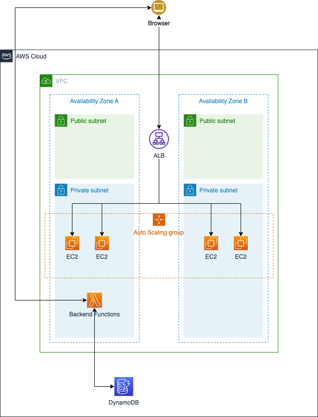
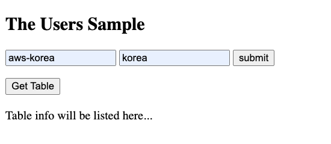
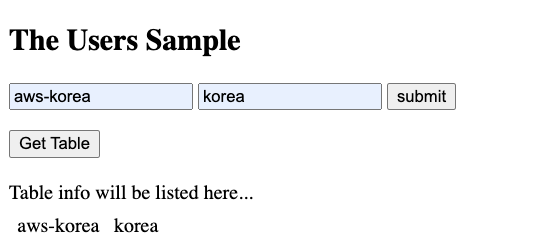

# API Server served by Lambda URL
This example shows how to use Lambda URL as API Server.



## Prerequisites
- Make sure you have [AWS CLI](https://docs.aws.amazon.com/cli/latest/userguide/install-cliv2.html) installed and configured with an aws account you want to use.

### install cdk
```shell
npm install -g aws-cdk
cdk --version
```

### create virtualenv
```shell
python3 -m venv .venv
source .venv/bin/activate
```

### install requirements
```shell
pip install -r requirements.txt
```

### setting AWS_PROFILE
```shell
export AWS_PROFILE=<the configuration profile for aws-cli>
```

# How to deploy

## First, Deploy stateful resources
```shell
cdk deploy LambdaURL/Stateful
```

## Second, Deploy stateless resources 
```shell
cdk deploy LambdaURL/Stateless
```

Then go to AWS Console.
1) In the console, go to EC2 and select Load Balancer which name would be "WebServerALB". 
2) In Description tab, find the "DNS name" and copy it.
3) Open web browser and Load the URL you just copied.


### Put Data
fill some data like below, then click "submit" button.



### Get Data
after you put some data, you can get the data by clicking "Get Table" button



## Security

See [CONTRIBUTING](CONTRIBUTING.md#security-issue-notifications) for more information.

## License

This library is licensed under the MIT-0 License. See the LICENSE file.